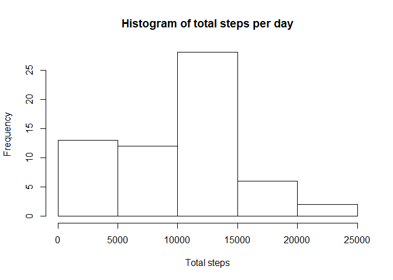
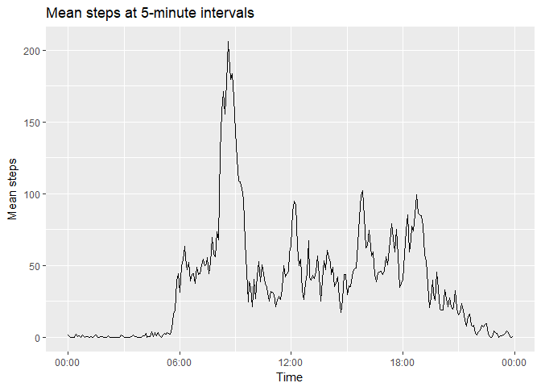
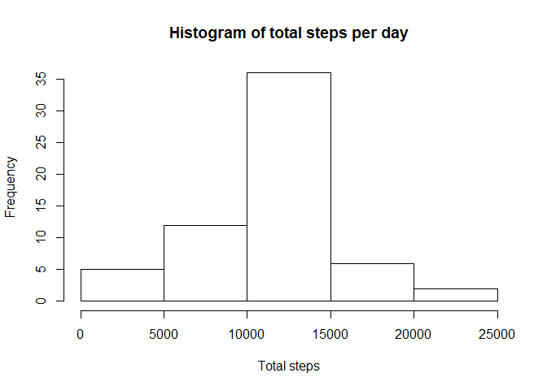
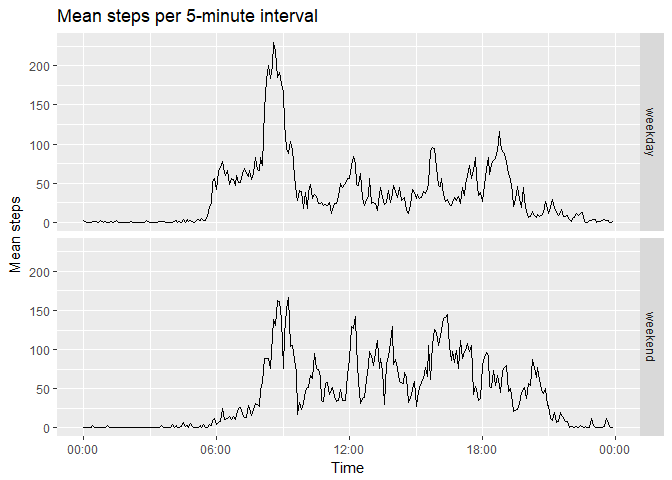

# Reproducible Research: Peer Assessment 1

This report analyses the accompanying `activity.zip` file, which contains footstep data collected from a personal activity monitoring device at five minute intervals between October and November 2012.

## Loading and preprocessing the data

The following code loads the ggplot2 library required for plotting the graphs in this report, and the stringr and scales libraries used to format times on the graph axes. It then extracts the `activity.zip` file and reads the resulting CSV file into memory.


```r
# Load required libraries
require(ggplot2)
require(stringr)
require(scales)

# Unzip the data and read it in.
unzip("activity.zip")
activity <- read.csv("activity.csv", stringsAsFactors = FALSE)
```


## What is mean total number of steps taken per day?

The following code summarises the footstep data, calculating the total number of steps on each day (ignoring missing values) and plots that data as a histogram. It also calculates the mean and median number of daily steps taken across all days.


```r
# Summarise the total number of footsteps by day.
totals <- aggregate(
    activity$steps, 
    list(Day = activity$date),
    sum, 
    na.rm = TRUE
)
mean_steps <- mean(totals$x)
median_steps <- median(totals$x)

# Plot a histogram of total steps each day.
hist(totals$x, main = "Histogram of total steps per day", xlab = "Total steps")
```



The mean number of steps taken per day was **9,354.23**. The median number of steps taken per day was **10,395**.


## What is the average daily activity pattern?

This code chunk summarises the footstep data by intervals within the day, instead of by day, calculating the mean number of steps for each 5-minute interval. It then renders a graph of these values, depicting the average daily activity pattern.


```r
# Summarise the mean number of footsteps by interval number.
interval_means <- aggregate(
    activity$steps, 
    list(interval = activity$interval), 
    mean, 
    na.rm = TRUE
)

# Plot the interval number against the mean number of steps in that interval.
plot <- ggplot(
    data = interval_means, 
    aes(x=strptime(str_pad(interval, 4, pad="0"), "%H%M", tz="UTC"), y=x)
)

plot + 
    geom_line() + 
    ylab("Mean steps") + 
    xlab("Time") + 
    scale_x_datetime(labels = date_format("%H:%M", tz="UTC")) +
    ggtitle("Mean steps at 5-minute intervals")
```



```r
# Get the interval number with the greatest average number of footsteps.
max_row <- which(interval_means$x == max(interval_means$x))
max_interval <- interval_means[max_row, "interval"]
```

The 5-minute interval with the greatest average number of steps is **835**, with **206.1698** steps.


## Imputing missing values


```r
num_nas <- sum(is.na(activity$steps))
```

The above code calculates the total number of missing values in the dataset: **2,304**.


```r
# Copy the activity data
filled_activity <- activity

# Define a function that looks up the mean step value for a given interval.
get_interval_mean <- function(interval) { interval_means[interval_means$interval == interval, "x"] }

# Fill any null step values in the copied data with the mean number of steps for the corresponding 
# interval.
filled_activity$steps[is.na(filled_activity$steps)] <- sapply(
    filled_activity$interval[is.na(filled_activity$steps)], 
    get_interval_mean
)
```

The above code aims to fill in the missing footstep values in the data using the previously-calculated average footstep data for the relevant interval.


```r
filled_totals <- aggregate(filled_activity$steps, list(Day = filled_activity$date), sum)
hist(filled_totals$x, main = "Histogram of total steps per day", xlab = "Total steps")
```



```r
mean_steps <- mean(filled_totals$x)
median_steps <- median(filled_totals$x)
```

The above code plots a histogram of the total number of steps taken each day using the new dataset with missing values replaced with interval averages. It also calculates the mean (**10,766.19**) and median (**10,766.19**) total number of steps taken per day. 

Clearly, these new values differ from those calculated earlier. In particular, because several days in the original dataset had no data available at all, the process of filling in average values from the activity patterns of other days has created several identical "average" days in the data. This raises the mean total (because an "average" day contains far more steps than the previous value of 0), and means that the median value is now itself a filled, "average" day, so the mean and median are now equal.

## Are there differences in activity patterns between weekdays and weekends?

The following code marks each value in the filled dataset with a factor variable indicating whether it is a weekday or a weekend, and plots separate mean activity profiles for weekdays and weekends.


```r
# Create factor variable describing weekend/weekday status of data.
weekend_days <- c("Saturday", "Sunday")
filled_activity$day_type <- as.factor(
  ifelse(weekdays(as.Date(filled_activity$date)) %in% weekend_days, "weekend", "weekday")
)

# Aggregate data to summarise interval means by weekend/weekday status.
filled_interval_means <- aggregate(
  filled_activity$steps, 
  list(interval = filled_activity$interval, day_type = filled_activity$day_type), 
  mean
)

# Plot summarised data.
plot <- ggplot(
    data = filled_interval_means, 
    aes(x=strptime(str_pad(interval, 4, pad="0"), "%H%M", tz="UTC"), y=x)
) 

plot + 
  geom_line() + 
  facet_grid(day_type ~ .) + 
  xlab("Time") + 
  scale_x_datetime(labels = date_format("%H:%M", tz="UTC")) +
  ylab("Mean steps") + 
  ggtitle("Mean steps per 5-minute interval")
```



Some differences can be observed between weekday and weekend activity profiles: in particular, the owner of the device appears to begin being active earlier in the day on weekdays, but is generally more active throughout the middle of the day at the weekend.
